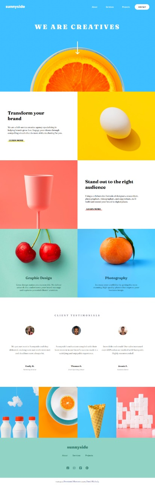

# Desafio - Frontend Mentor - Sunnyside agency landing page solution

Esse é um desafio do Frontend Mentor com o objetivo de treinar e desenvolver habilidades nível Júnior numa landing page responsiva.

### O desafio

Os usuários devem ser capazes de:

- Visualizar o layout ideal para o site, dependendo do tamanho da tela do dispositivo

- Ver estados de foco para todos os elementos interativos na página

  

### Screenshot

### Links

- Solução URL: https://dani-michely-sunnyside-clone.netlify.app/

## Meu processo

### Construído com

- HTML5

- CSS3

- Flexbox

- CSS Grid

- Pseudo Elements

- Mobile-first

- Media Query

- Javascript

  

### Recursos Úteis

- https://htmlcolors.com/hex-to-hsl - Este site me ajudou a converter as cores de Hexadecimal para HSL. Isso foi fundamental para manter o projeto padronizado.

## Autora

- Website - https://www.linkedin.com/in/dani-michely/
- Github - https://github.com/danimichelydev
- Frontend Mentor - @danimichelydev
- Instagram - @danielamichely

